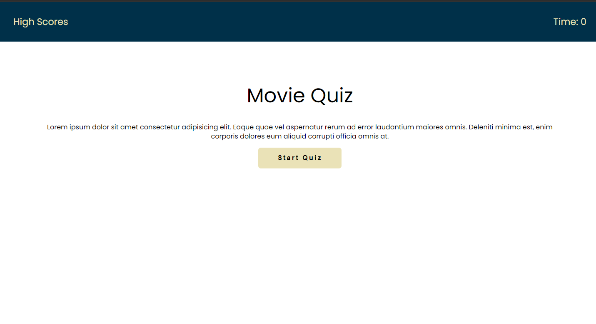
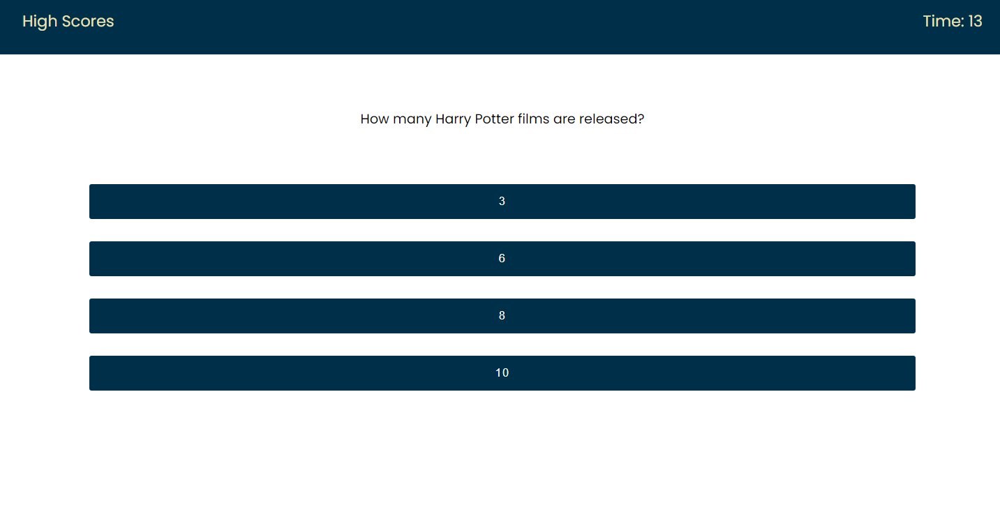
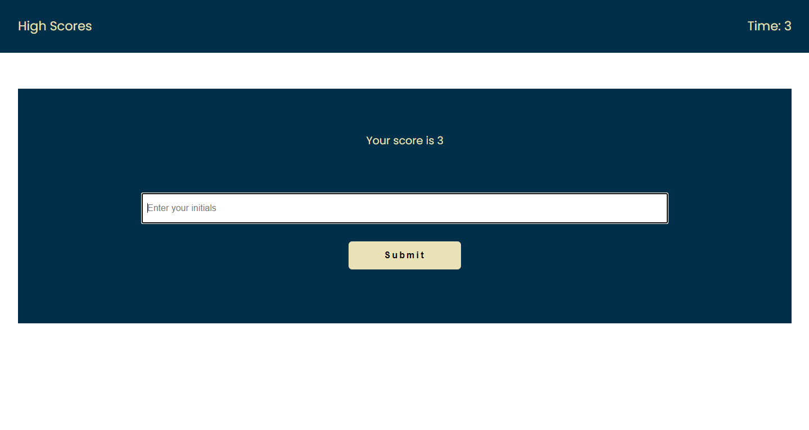
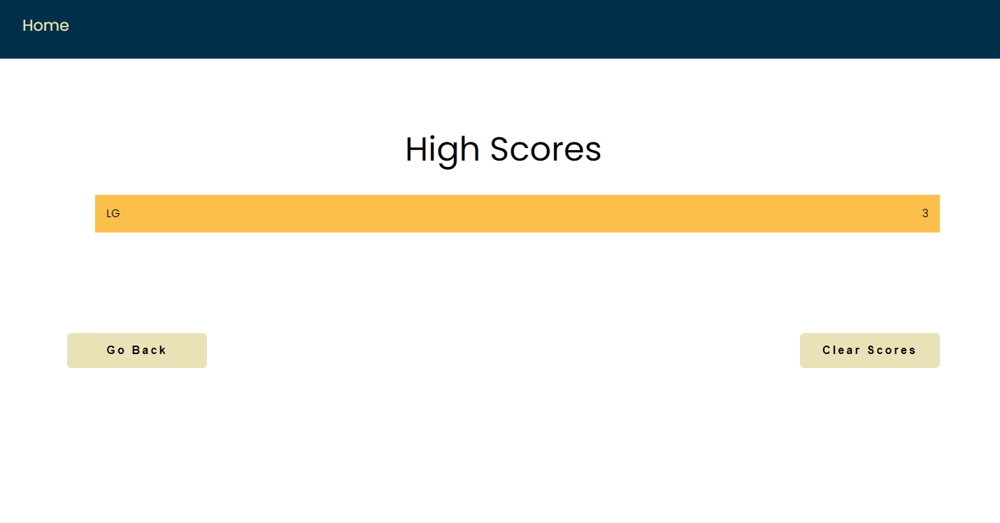
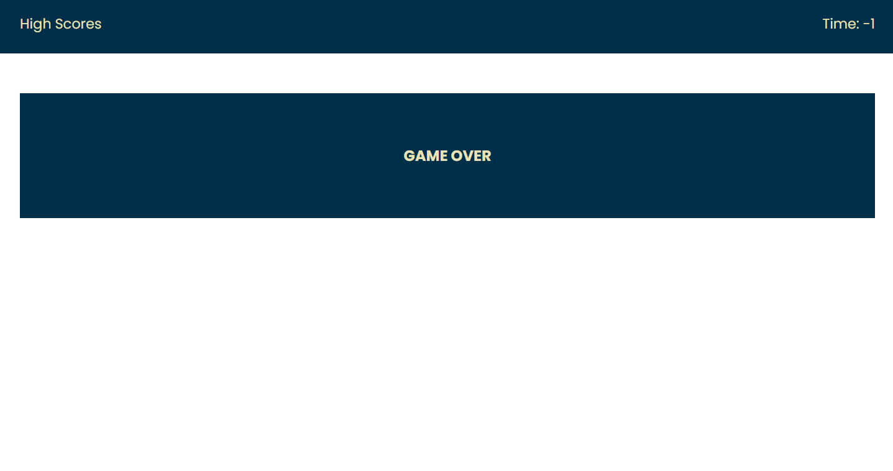
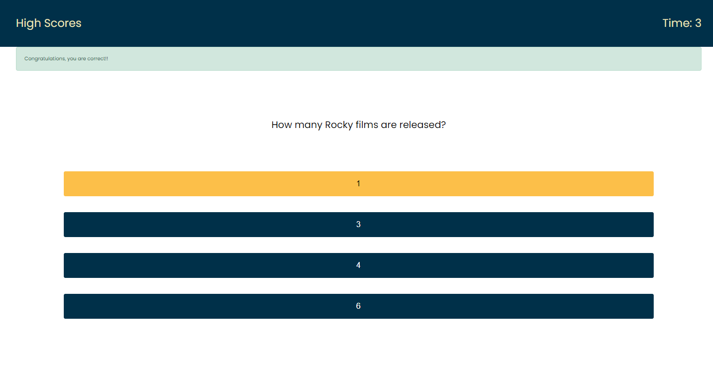
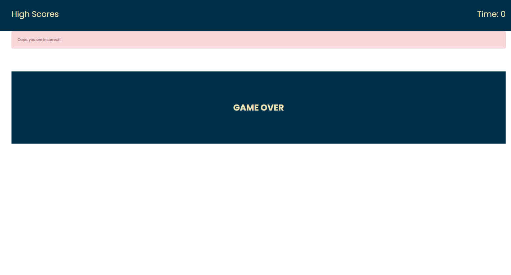

# JAVASCRIPT QUIZ(COMPLETE)

## PROJECT DESCRIPTION

Objective was to create a timed, multiple answer quiz using Javascript.

## LINK TO WORKING PAGE

Click [here](https://lenny-g.github.io/quiz-app-javascript/) for finished webpage

## SCREENSHOTS

This is a screenshot of the start page of the quiz

This is a screenshot of a set of questions from the quiz

This is a screenshot of the form in which you enter your initials to be saved in the highscores page

This is a screenshot of the page of highscores

This is a screenshot showing the lack of a form when finishing the quiz with no time left

This is a screenshot showing an alert when a question is answered correctly

This is a screenshot showing an alert when a question is answered incorrectly

## WORK ACHIEVED :

- Created a timed javascript quiz that is responsive
- Created multiple choice questions
- Created alerts for wrong and correct answers
- Created a form to enter and store highscores
- Created a game over page